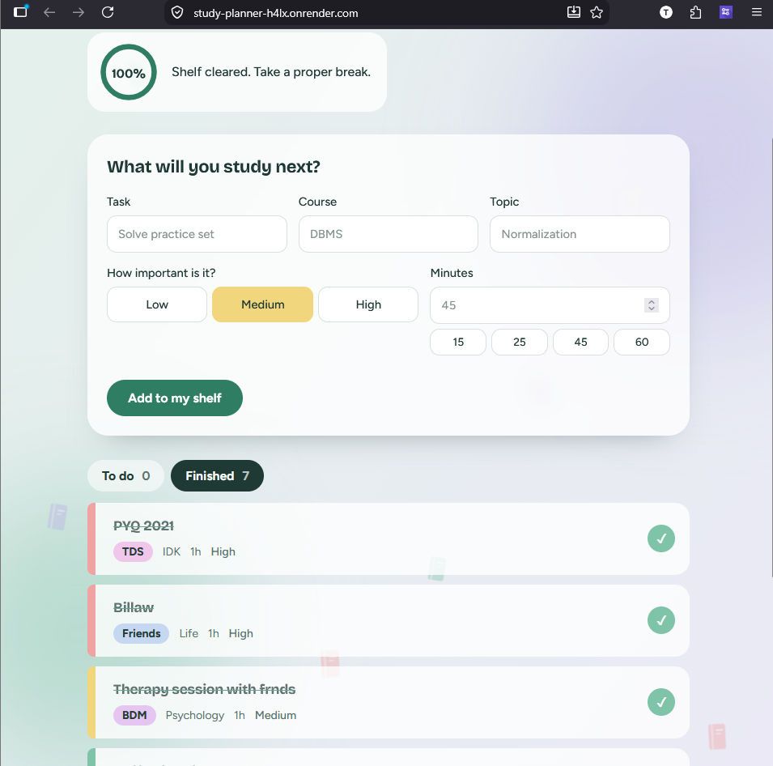
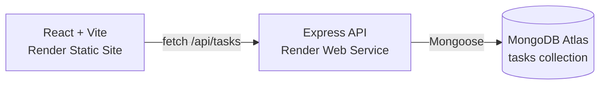

<p align="center">
  
</p>

<p align="center">
  <a href="https://study-planner-h4lx.onrender.com/"></a>
</p>

<p align="center">
  
  
  
  
  
  
</p>

A calm, motivating study planner built with the MERN stack. Log a task with its course, topic, priority and duration, mark it complete, and watch your progress ring fill up while books drift across the screen.




## Live demo

**https://study-planner-h4lx.onrender.com/**

The backend runs on Render's free tier, so the first load after a quiet period can take up to about 50 seconds while it wakes up.

## Features

- Add a task with a title, course name, topic name, priority (Low, Medium, High) and duration in minutes
- Quick-pick duration chips (15, 25, 45, 60) for one-tap entry
- Mark tasks complete, with a small confetti burst
- **To do** and **Finished** tabs with live counts
- Progress ring and a message that changes as you finish tasks
- Course tags get a consistent colour, and priority shows as a colour on each card's spine
- Validation on both the client (friendly messages) and the server (the source of truth)
- Loading, error and empty states, and a retry button when the server is asleep
- Responsive layout and `prefers-reduced-motion` support

## Architecture



```
mern-study-planner/
├── ARCHITECTURE.md        # planning document used to drive the build
├── backend/
│   ├── server.js          # Express app, CORS, startup
│   ├── config/db.js       # Mongoose connection
│   ├── models/Task.js     # Task schema
│   └── routes/taskRoutes.js
└── frontend/
    └── src/
        ├── App.jsx        # state, tabs, progress ring, drifting books
        ├── api.js         # fetch helpers
        ├── index.css
        └── components/    # AddTaskForm, TaskList, TaskItem
```

## Data model

| Field | Type | Rules |
|-------|------|-------|
| `title` | String | Required, trimmed, 1 to 100 characters |
| `courseName` | String | Required, trimmed, 1 to 60 characters |
| `topicName` | String | Required, trimmed, 1 to 80 characters |
| `priority` | String | `Low`, `Medium` or `High` (default `Medium`) |
| `duration` | Number | Whole minutes, 1 to 600 |
| `completed` | Boolean | Default `false` |
| `completedAt` | Date | `null` until completed |

## API

Base path: `/api/tasks`. Errors return `{ "error": "message" }`.

| Method | Path | Purpose | Success | Errors |
|--------|------|---------|---------|--------|
| `POST` | `/api/tasks` | Create a task | `201` | `400` invalid input |
| `GET` | `/api/tasks?status=pending\|completed` | List tasks, newest first | `200` | `400` invalid status |
| `PUT` | `/api/tasks/:id/complete` | Mark a task completed | `200` | `400` bad id, `404` not found, `409` already completed |

## Edge cases handled

- Empty and spaces-only title, course and topic
- Priority outside Low, Medium, High
- Duration of `0`, negative, decimal, non-numeric or above 600
- Malformed, unknown and already-completed task ids
- Empty lists, and the backend being asleep or unreachable

## Run it locally

You need Node.js (LTS) and a MongoDB Atlas cluster.

```bash
git clone YOUR-REPO-URL
cd YOUR-REPO-FOLDER
```

**Backend**

```bash
cd backend
npm install
```

Create `backend/.env` (never commit it):

```
MONGO_URI=your Atlas connection string, with /studyplanner before the ?
PORT=5000
CLIENT_URL=http://localhost:5173
```

```bash
npm run dev
```

**Frontend** (in a second terminal)

```bash
cd frontend
npm install
```

Create `frontend/.env`:

```
VITE_API_URL=http://localhost:5000
```

```bash
npm run dev
```

Open http://localhost:5173.

**Troubleshooting:** if the backend fails with `querySrv ECONNREFUSED`, your network is blocking the DNS lookup Atlas needs. `config/db.js` already switches Node to public DNS servers to work around it.

## Deployment (Render)

| Service | Type | Root directory | Build | Start / publish |
|---------|------|----------------|-------|-----------------|
| API | Web Service | `backend` | `npm install` | `node server.js` |
| App | Static Site | `frontend` | `npm install && npm run build` | publish `dist` |

- API environment: `MONGO_URI`, `CLIENT_URL` (the frontend URL, with no trailing slash)
- Static site environment: `VITE_API_URL` (the API URL, with no `/api`), read at build time
- Static site rewrite rule: `/*` to `/index.html`, action **Rewrite**
- Atlas Network Access allows Render's changing IPs

## How it was built

The project followed an AI-assisted workflow: plan first, then build one slice at a time.

1. Planned the features, architecture, data model and edge cases in `ARCHITECTURE.md` before any code
2. Built the backend endpoint by endpoint, testing each with valid and invalid input
3. Built the React frontend against the working API
4. Inspected the generated code and removed anything unplanned, such as an extra test framework the assistant added
5. Committed after each tested slice, kept secrets out of Git, then deployed

## Testing

- API checked with valid and invalid requests: empty and spaces-only title, invalid priority, zero duration, complete once, then complete again
- UI checked for empty-form errors, add, complete, refresh persistence and the phone layout
- Live deployment checked on desktop and on a phone

<!-- Once friends have actually tried the live link, uncomment this line and fill in the real number and feedback:
- **Peer testing:** shared the live link with N friends; feedback: ...
-->

## Known limits and next steps

This is version 1: **a single shared board with no authentication**, so everyone with the link sees the same tasks.

- [ ] User accounts (signup and login with JWT) and a `userId` on every task, so each person sees only their own
- [ ] Edit and delete tasks
- [ ] Rate limiting on the API
- [ ] Study streaks and a weekly summary

## Author

Built by Twisha for a MERN and AI-assisted development workshop.
